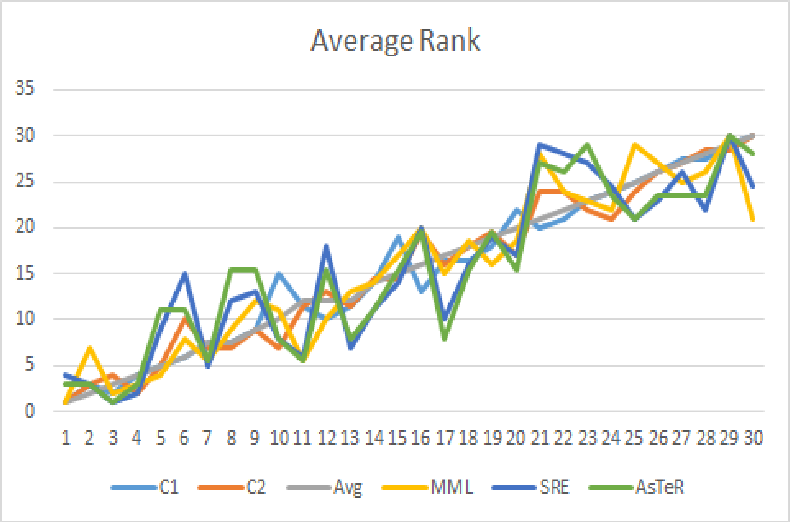
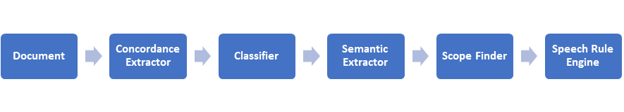

***Head

:::Icon logos/favicon.ico
:::CSS node_modules/normalize.css/normalize.css minify
:::CSS resources/styles.css minify
:::Script resources/scripts/mathjax-conf.js minify
:::Script https://cdn.jsdelivr.net/npm/mathjax@3.2.2/es5/tex-mml-chtml.js
:::Script resources/scripts/general-conf.js minify
:::

***

***TitleSlide

:::Title Comprehensive Accessibility of Equations by Visually Impaired
:::
:::Author Akashdeep Bansal
:::

***Affiliations
:::Affiliation
Supervisors: Prof. M Balakrishnan and Prof. Volker Sorge
IIT Delhi

[cse.iitd.ac.in/~akashdeep/](https://www.cse.iitd.ac.in/~akashdeep/)
[akashdeep@sit.iitd.ac.in](mailto:akashdeep@cse.iitd.ac.in)
:::

*******************

## Outline

* Introduction & Motivation
* Problem Statement
* Related Work
* Cognitive Complexity Analysis
* Contextual Semantic Analysis
* Conclusion

## Introduction & Motivation

* Audio rendering and tactile Braille are the two main modalities used by persons with blindness for accessing content.
* Braille uses 6/8 dots system -- only 64/256 symbols possible.
* Audio is the preferred modality due to
  - ease and cost of production
  - the possibility of digital dissemination 
  - no need for specially trained instructors to teach Braille/Tactile Graphics
  - accessed through screen readers
  - also beneficial for persons with cognitive disability and motor impairment

Hence, audio is the preferred modality....

## Challenge: Cognitive Complexity

* Audio is linear in nature.
* Expressing and understanding equations are the core requirement in STEM.
* Equations are 2D in nature.
* Challenge due to linearization; 
  - ``a plus b divided by c plus d"can be $\frac{a+b}{c+d}$, $a+\frac{b}{c}+d$, $a+\frac{b}{c+d}$, or $\frac{a+b}{c}+d$ 
  - $x=\frac{-b \pm \sqrt{b^2-4ac}}{2a}$ results into 25 to 30 words
  - time-consuming and very difficult
  - strictly not necessary to go through the complete equation for casual reading

Faithful and unambiguous voicing leads to a very lengthy speech output -- higher cognitive load and takes valuable reading time

## Challenge: Contextual Semantic

Audio rendering of the equations not only depends on the syntax but also depends on the contextual semantics

| **Expression** | **Various Possibilities** | **Syntactic Rendering** |
| -- | -- | -- |
| $A \times B$ | Multiplication, Cartesian product of A and B, Cross product of A and B, A by B (In case of Matrix dimension) | A times B |
| $A'$ | A transpose, First derivative of A, A feet, Lable to a point on a line, Another variable having similar properties as A | A prime |
| $A''$ | Second derivative of A, A inch | A double prime |
| $\|A\|$ | Absolute value of A, Modulus of the complex number A, Order of A, Determinant of the matrix A, Cardinality of A | Vertical line A vertical line |
| $111001$ | Binary number, Decimal number | One hundred eleven thousand and one |
| $(a,b)$ | Cartesian point, Open set, Ordered pair, Cycle, GCD of a and b | left paran a comma b right paran |
| $f(x+y)$ | f is a function of $x+y$, f multiply $x+y$ | f left paran x plus y right paran |
| $:$ | Ratio ($a:b$), Map($f:A\rightarrow B$), Such that ($A = {x: x \text{is a positive real number}}$) | colon |
| $<A>$ | Cyclic sub-group, Ensemble average | less A greater |
| $\bar{Z}$ | Complex conjugate, Mean, Topological closure, Algebraic closure | Z bar |

## Related Work

* Various cues proposed; Lexical, Prosodic, Earcons, Spearcons, Audio Spatialization, etc.
* Various user studies found  that these cues are not very effective in making rendering  unambiguous and cognitively efficient.
* Proposed alternatives:
  - Hierarchical navigation
  - Summarization
  - Operator abstraction and variable substitution.

## Related Work: Variable Substitution

* Equation Accessibility Systems; AsTeR and MathJax
* Mainstream computer algebra systems; Mathematica and Maple
* Complexity metrics based on internal representation.
* How effective they address the cognitive load of the reader?

## Cognitive Complexity: Objective

Complexity Measures used in open-source systems for math accessibility

* AsTeR – Quasi prefix form derived from LaTeX
* Speech Rule Engine (SRE) – Semantic tree derived from input MathML
* MathJax – Internal MathML like structure (MJX)
* MathJax – Enriched version refined based on the SRE semantic (MJXe)

How the cognitive load on the reader can be evaluated?

To what extent the complexity metrics used currently model this load?

## User Study

**Research Question**

Which of the proposed open-source complexity metrics have highest correlation factor with the user’s experienced cognitive complexity for algebraic equations when rendered through audio?

**Participants**
  - 18 Blind and Visually Impaired persons with STEM background
  - Contacted through our network channels and accessibility mailing lists
  - Screening criteria; STEM background and Regular screen reader user

**Demographics**
  - 13 Blind and 5 with very low vision
  - Age: 16 to 41 years (Avg: 24.06)

## Complexity Metric

Cognitive Complexity Parameters
* Total Time Taken
* Thinking Time
* Number of Attempts
* Types of Mistakes
* Number of Mistakes

Structural Complexity Parameters
* Height
* Weight
* Total Number of Nodes
* Maximum Number of Children of a Node
* Types of Operators

Relation among them??

## User Study: Equations

* Artificially constructed equations to remove the bias due to familiarity
* Patterns among operators and variables were avoided
* Algebraic equations using only the four basic arithmetic operations and exponentiation
* Test data: 30 equations of varied complexity
* Complexity derived from symbol count and tree depth of corresponding MathML expression.
* Equally distributed in 9 sets of 10 equations -– presented one set to 2 participants

## User Study: Subset of Equations


## User Study: Protocol and Setup

**Protocol**
* Listen to the entire expression without noting down anything
* Reproduce the expression
* Report the confidence on correctness assuming it was an examination
* Repeat up to 5 times/equation in case of incorrect reproduction or lack of confidence

**Setup**
* Phase 1 (Pre-COVID era): Through Skype Call
* Phase 2 (COVID era): Web application
  * Rendered with NVDA and MathPlayer using ClearSpeak Rules
  * All the sessions were video recorded

## Correctness Criteria

**Structural Correctness**
  * Position of operators, number of terms and layout features recalled correctly
  * Individual value of terms or operators do not necessarily have to be correct

**Reproduction Correctness**
  * Structural correctness
  * All its terms and operators are correct

## Assessment Criteria

1.  Minimum number of attempts for structural comprehension
2.  Minimum number of attempts to reproduce the equation
3.  Total number of attempts  for confident reproduction
4.  Error types and their numbers

Equation Ranking Criteria (C)
- C1: Ability to comprehend:   (1) > (2) >  (3) > (4)
- C2: Ability to reproduce:  (2) > (1) > (3) > (4)
- Avg: Average  of C1 and C2

Ranks were averaged out to remove individual bias.

## Average Ranks

{width="2500"}

C1: Ability to comprehend, 
C2: Ability to reproduce, 
Avg: Average, 
MJX: MathJax, 
MJXe: MathJax’s enriched version, 
SRE: Speech Rule Engine, 
AsTeR: Audio System for technical reading

## Correlation

|  | **C1** | **C2** | **Avg** | **MJX** | **MJXe** | **SRE** | **AsTeR** |
| :-- | --: | --: | --: | --: | --: | --: | --: |
| **C1** | 1 | 0.957 | 0.989 | **0.882** | 0.827 | 0.775 | 0.805 |
| **C2** | 0.957 | 1 | 0.989 | **0.932** | 0.911 | 0.865 | 0.864 |
| **Avg** | 0.989 | 0.989 | 1 | **0.918** | 0.879 | 0.83 | 0.844 |

{style="border-spacing: 20px"}

MJX has highest correlation with all metrices (C1, C2, and Avg)

## Clustering based Analysis

* Relativeness is more important than complexity’s absolute value
* Clustered using k-mean (k = 5)
* Again, MJX has highest overlap
  * 19 with C1
  * 20 with C2
  * 22 with Avg

## Contextual Semantic

- Audio rendering of equations depends on the context
- Syntactic rendering leads to higher cognitive load.
- True meaning of mathematical symbols can only rarely be deduced by their occurrence in a single formula alone


**Source of Semantic Definition**

1) The symbol is never defined within the document, but is well understood in general or in an area of mathematics.
2) It is defined once within the document and is expected to carry that meaning throughout the document.
3) It is defined multiple times within the document and is expected to carry that meaning only within the scope of those definitions. 

Scope: Scenario 2 --- can be learned from the document itself

## Architecture

{width="5000"}

## Concordance Extractor

- Identifies the mathematical entities in the given HTML/XML document.
- Search for MathML, Bold, Italic, and LaTeX.
- Construct concordance; Identified entity, five previous and five next words.

Why not the sentences??

- To avoid multiple definition within a single concordance
- All definitions are not defined in sentences.

| **Concordance** | **Definition (Yes/No)** | **Explanation** |
| -- | -- | -- |
| We present, in dimension **$n \geq 2$**, a survey of samples to:  | Yes | $n$ is a dimension. |
| ensuring that an equilibrium point **$x^*$** is a local attractor is | Yes | $x^*$ is a point. |
| $JF(x)$, the Jacobian matrix of {\color{red} $F$} at $x$, has negative real | No | The definition of $F$ is not given; even though you can infer that $F$ is a function, this is not explicit in this concordance. |
| restricted to the invariant plane {\color{red} $z=0$} is a center. Moreover, perturbing &	No | Even though $z=0$ is a plane is defined in this concordance. Still, to infer that $z$ is a dimension, you require prior domain knowledge. That is why it is not a valid mathematical definition. Here, we are only looking for the concordances which have the proper definition of the symbol within the concordance. |

## Classifier

Filter concordances, whether contain valid mathematical definition or not

**Ground Truth**

Training : Testing = 80 : 20

| **Label** | **Total Number** |
| -- | -- |
| 1 | 892 |
| 0 | 4199 |

Here, $0$ represents "doesn't contain a valid mathematical definition" and $1$ represents "contains a valid mathematical definition".

## Classifier: Results of Various Models

| | **Naive Bayes** | **SVM** | **NN** | **CNN**| **Random Forest** |
| -- | -- | -- | -- | -- | -- |
| **Accuracy** | 0.841 | 0.852 | 0.855 | 0.866 | 0.876 |
| **f1-score** | 0.652 | 0.702 | 0.717 | 0.748 | 0.749 |

- CNN and Random forest are coming out to be better choice for the classification model.
- Found stopwords to be useful.

## Semantic Extractor

- Pattern matching based approach
- Rules based on the patterns in the concordance string and their POS form

```
for (allRules) {
  if (preCondition) {
    action;
  }
}
```

## Semantic Extractor: Sample Rules

- If CENTERMATH followed by `,/is/are' followed by `called/said' then the Noun Phrase (NP) present post the specified pattern is a potential definition
  - can define a new set CENTERMATH , called the Cartesian product of
  - The set CENTERMATH is called the domain of
  - is MATH, i.e., MATH, then CENTERMATH is said to be onto
- If ADV (Adverb)/SCONJ (Subordinating Conjuction)/CCONJ (Coordinating Conjuction) is present in the prefix then remove everything before ADV/SCONJ/CCONJ (inclusive)

- Developed 30 such rules.
- Get applied in a particular order
- The NP which survives till the end is the semantic corresponding to the CENTERMATH

## Semantic Extractor: Results

**Dataset**

- Total corpus: 1025 concordances
- Concordance with valid definition: 288
- Concordance without valid definition: 737

**Results**

- Precisely extracted 307/309 definitions (Accuracy: 99.35%)
- Rejected 62% of concordances not containing valid definition

## Conclusion

* Efforts towards understanding the cognitive load of  equations on users
* Comparative assessment of open-source complexity metrics
* Conclusion: MJX Complexity metric has the highest correlation
* Proposed architecture for contextual semantic analysis of equations
* Integrated with MathJax and SRE

**Applications**
- To enhance the readability of equations in Braille and verbal description of diagrams
- Can be a core component in development of user adaptable accessibility technology
- potential to help in processing documents to automatically tag mathematical content, make it amenable to search and extract mathematical knowledge for further processing and handling by computational systems.

## Open Questions

- Can this result hold for equations other than algebraic ones?
- Impact of user characteristics such as education on the results
- Which is the most appropriate delivery mechanism?
- Is the choice of windowSize = 5 optimum?
- Is the semantic extractor algorithm holds valid across various domains and writing styles used by various authors?
- Algorithm for scope finding?

## Publications
